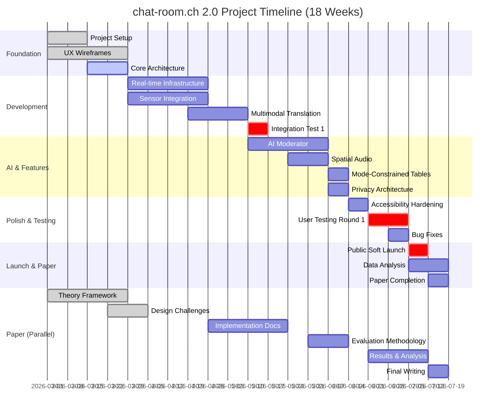
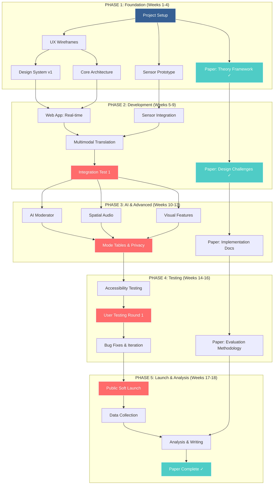
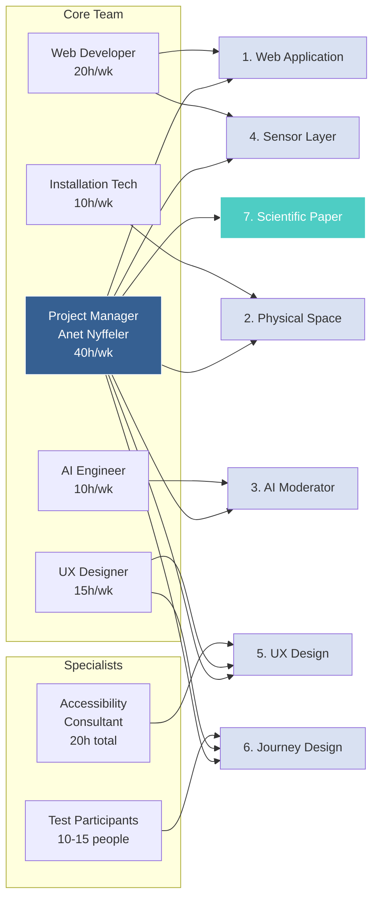
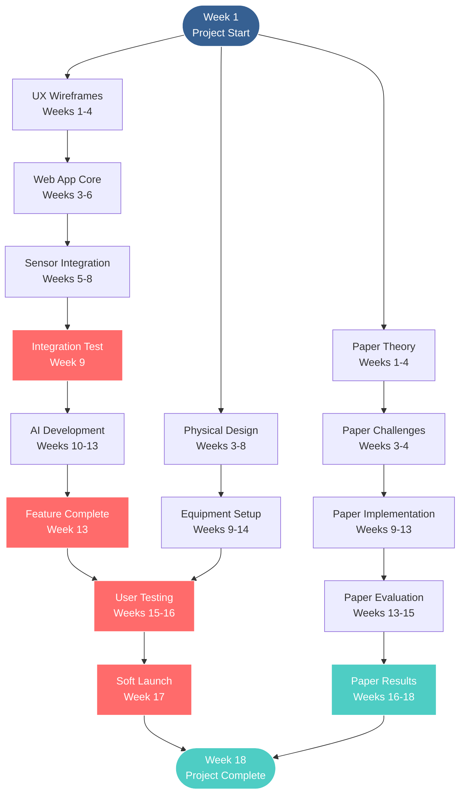
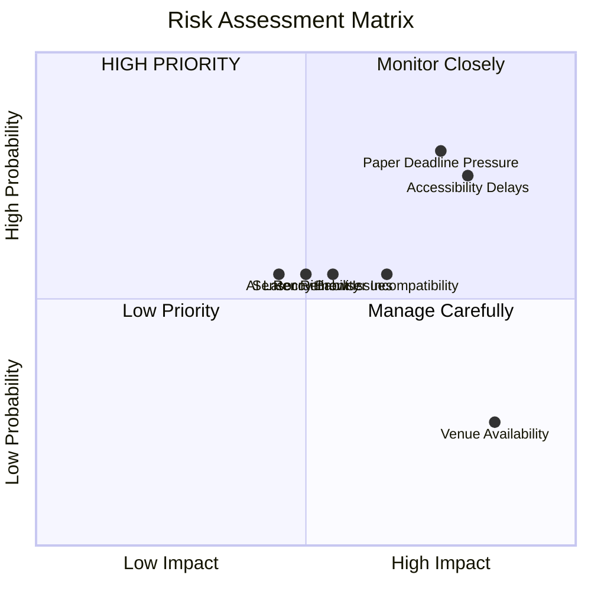
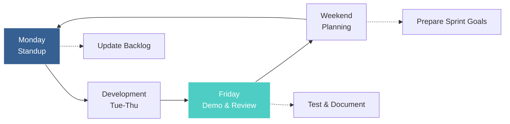

# chat-room.ch 2.0 Visual Workflow Diagrams

## Gantt Chart (4.5 Month Timeline)

## Workflow & Dependency Diagram

## Work Package Ownership Map

## Critical Path Analysis

## Risk Heat Map

## Weekly Sprint Cycle

